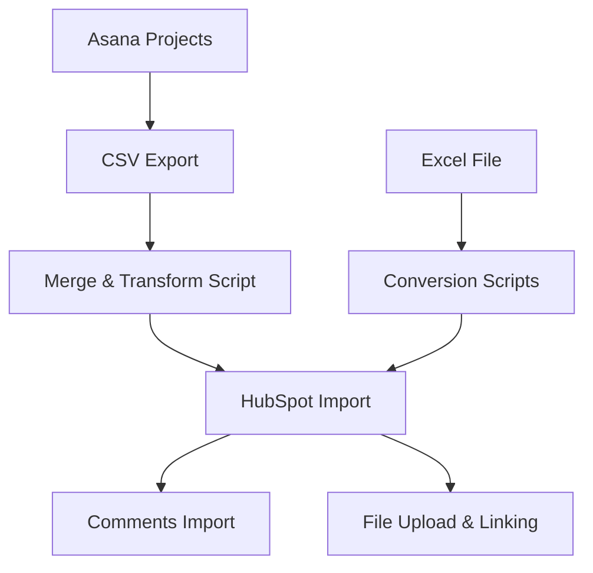

# MOSIS 2.0 HubSpot Initial Setup (Tech Guide)


This document describes the full workflow for importing and integrating MOSIS 2.0 data into HubSpot.

---

## 📚 Table of Contents

- [Overview](#overview)
- [Data Sources](#data-sources)
- [Full Import Workflow](#full-import-workflow)
- [Asana Data Import](#asana-data-import)
- [Comments Import](#comments-import)
- [File Attachments](#file-attachments)
- [Excel Data Import](#excel-data-import)
- [Pipeline Mapping](#pipeline-mapping)
- [Forms](#forms)
- [Post-Import Checklist](#post-import-checklist)
- [Best Practices](#best-practices)

---

## 🧭 Overview

This workflow:
- Imports operational data into HubSpot CRM
- Creates:
  - Contacts
  - Companies
  - Deals
- Preserves:
  - Comments (as Notes)
  - Attachments
  - Relationship mapping

---

## 📊 Data Sources

| Source | Description |
|------|------------|
| Asana | Project/task operational data |
| Excel | External customer engagement tracking |

---

## 🔄 Full Import Workflow



---

## 📥 Asana Data Import

### 1. Export Asana Projects (Manual)
Export all relevant Asana projects as CSV files.

---

### 2. Merge CSV Files

```bash
python merge_and_split_with_domains.py -i csv-total-2026-4-23 -o merged-total-domain.xlsx
```

---

### 3. Import into HubSpot

Path:
> Import Data → Advanced imports → Contacts, Companies, Deals

Settings:
- Create Contacts
- Create Companies
- Create Deals

---

### 🔧 Data Fixes Required
The following fields of HubSpot deals must be adjusted.

| Field | Fix |
|------|-----|
| Task Assignee | Map emails to names |
| Deal Stage | MPW/Fab pipeline and stage mapping |

---

### 🏷 HubSpot Deal Naming (Asana)

```
[A] {Asana Record Name}-{Foundry}-{Index}-{First Name}
```

- `[A]` denotes it is imported from Asana
- Omit fields if missing

---

### 🧩 Pipeline Mapping
All the imported deals are put the default pipeline and deal stage shown below.
HubSpot user must change them.

| Asana Workflow | HubSpot Pipeline |
|---------------|----------------|
| Fab | Fab [1. Customer Evaluation] |
| MPW | MPW [1. Customer Evaluation] |

---

## 💬 Comments Import

### Export comments

```bash
python export_asana_projects_to_csv.py --projects projects.txt --outdir ./csv-total
```

### Import as HubSpot Note

```bash
python hubspot_import_comments_as_notes.py --input ./csv-total --log notes_import_log.csv
```

---

## 📎 File Attachments

### Download attachments

```bash
python asana_download_attachments.py --projects projects.txt --outdir ./asana_downloads --manifest attachments_manifest.csv
```

---

### Upload and link to deals

```bash
python hubspot_upload_and_attach.py --manifest attachments_manifest.csv --file-folder "/AsanaUploads"
```

---

### Rename uploaded files

```bash
python rename_hubspot_files.py
```

Removes internal identifiers while preserving attachments.

---

## 📊 Excel Data Import

### Download latest file
https://cadreams.egnyte.com/dl/XBBkTfxPP7Hd

---

### Convert tabs

```bash
python mpw.py
python fab.py
python gomactech.py
python ims.py
```

---

### Import into HubSpot

Import all files as:
- Contacts
- Companies
- Deals

---

## ⚙️ Pipeline Mapping
All the imported deals are put the default pipeline and deal stage shown below.
HubSpot user must change them.

| File | Pipeline |
|------|---------|
| MPW.xlsx | MPW [1. Customer Evaluation] |
| Fab.xlsx | Fab [1. Customer Evaluation] |
| GOMACTech2025.xlsx | M2 Initial Contact |
| IMS2025.xlsx | M2 Initial Contact |

---

## 🧾 Forms

Forms are used for:
- Support requests <https://41foi7.share-na2.hsforms.com/2AQ9QZXnnSf-KgVpNnNLmPQ>
- Onboarding <https://41foi7.share-na2.hsforms.com/2pctH1Cx9SiqX27mwhUBeWw>
- General inquiries <https://share-na2.hsforms.com/26iIaV3xGSNClslaHCTuhKQ41foi7>
- MPW Run Request <https://41foi7.share-na2.hsforms.com/27qpYgGGsS9yn3TWTGp13HQ>
- NDA Information Collection <https://41foi7.share-na2.hsforms.com/2j6cJQWvbTXCMBWSkg1U_kg>

Note:
- All forms create tickets except NDA Information Collection form.
- HubSpot users must not use the NDA Information Collection form directly. It is used in HubSpot Email template.

---

## ✅ Post-Import Checklist

- [ ] Verify deal pipelines and stages and make changes.
- [ ] Confirm attachments are linked.
- [ ] Validate Notes content.
- [ ] Check comment imports.
- [ ] Test all forms. Once the tests are passed, embed the forms to MOSIS 2.0 homepage.
- [ ] Verify sample deals manually.

---

## ⚠️ Best Practices

- Always test with a small dataset first
- Keep backups of original files
- Validate mapping before full import
- Review duplicate handling logic
- Confirm file attachment integrity

---

## 🙌 Summary

This workflow ensures:
- Clean migration from Asana → HubSpot
- Structured CRM data
- Full preservation of context

